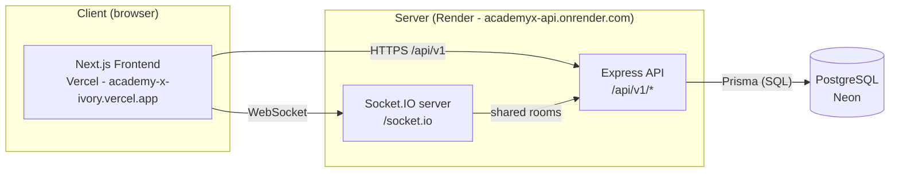
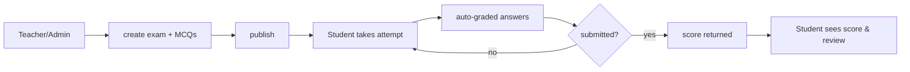
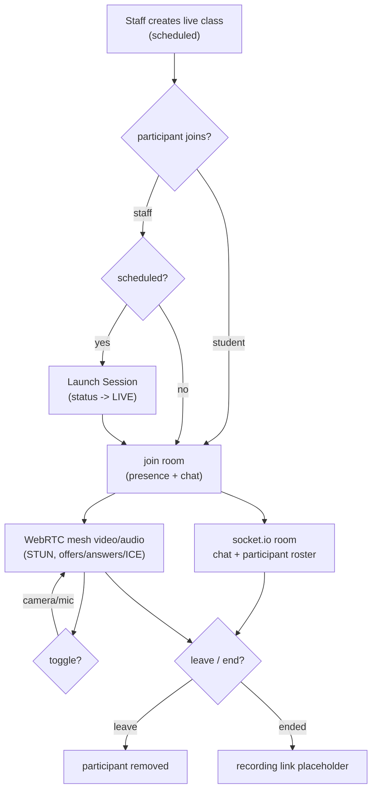
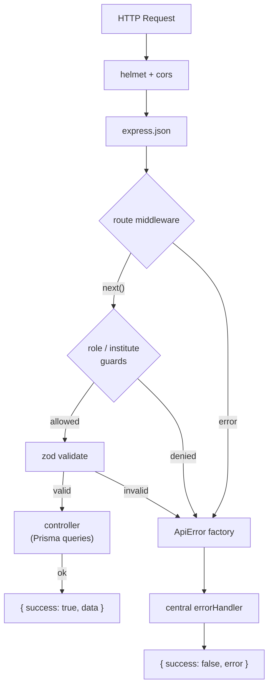
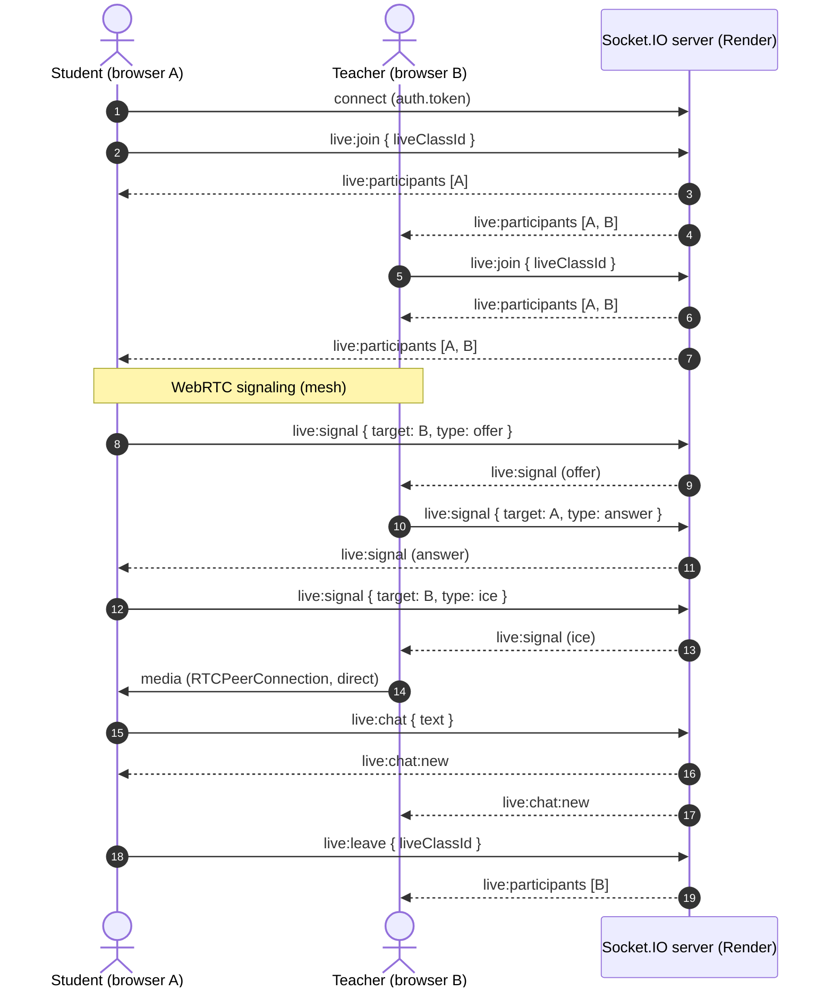
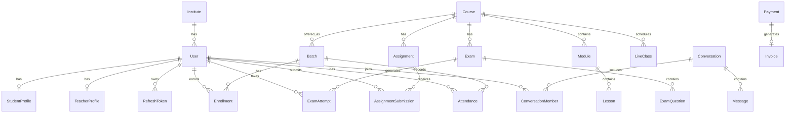

# Zenrix

**The Operating System for Coaching Institutes** — a multi-tenant EdTech SaaS platform that lets coaching centers run their entire academy from a single web app: students, teachers, courses, batches, live online classes, exams, assignments, messaging, notifications, and payments.

- **Web app**: https://academy-x-ivory.vercel.app
- **API (REST)**: https://academyx-api.onrender.com/api/v1
- **API health check**: https://academyx-api.onrender.com/health
- **Real-time socket**: `https://academyx-api.onrender.com/socket.io` (Socket.IO)
- **DB**: PostgreSQL hosted on Neon

---

## Table of Contents

1. [Project Overview](#1-project-overview)
2. [Live Demo & Demo Accounts](#2-live-demo--demo-accounts)
3. [Tech Stack](#3-tech-stack)
4. [Repository Layout](#4-repository-layout)
5. [Core Features](#5-core-features)
6. [Roles & Permissions](#6-roles--permissions)
7. [Backend Architecture](#7-backend-architecture)
8. [Frontend Architecture](#8-frontend-architecture)
9. [Data Model](#9-data-model)
10. [API Reference](#10-api-reference)
11. [Configuration & Environment Variables](#11-configuration--environment-variables)
12. [Local Development Setup](#12-local-development-setup)
13. [Available Scripts](#13-available-scripts)
14. [Deployment & CI/CD](#14-deployment--cicd)
15. [Design System](#15-design-system)
16. [Documentation](#16-documentation)
17. [Roadmap & Known Limitations](#17-roadmap--known-limitations)

---

## 1. Project Overview

Coaching institutes typically juggle spreadsheets, WhatsApp groups, and disconnected tools for admissions, scheduling, exams, live classes, communication, and billing. This causes lost data, no single source of truth, and a poor student experience.

Zenrix consolidates all of it. Each coaching institute is an **isolated tenant** with its own admin, teachers, students, courses, and batches. A platform-level **Super Admin** manages all institutes.

```mermaid
mindmap
  root((Zenrix))
    Platform
      Multi-tenant institutes
      Super admin
      Analytics
    Auth & RBAC
      JWT access + rotating refresh
      Forgot / reset password
      Roles (4): SUPER_ADMIN / INSTITUTE_ADMIN / TEACHER / STUDENT
      Role login portals
    Academics
      Courses, modules, lessons
      Batches & enrollment
      Attendance
      Recorded lectures & materials
    Assessment
      Exams (MCQ, auto-graded)
      Assignments + grading
    Live classes
      Scheduling & status
      Socket.IO chat + presence
      WebRTC mesh video/audio
    Communication
      Direct messages
      Per-batch community groups
      Notifications
      Support tickets
    Commerce
      Payments (backend records)
      Invoices
      Razorpay checkout (planned)
    UX
      Landing page (mobile-first)
      Onboarding wizard
      Role dashboards & reports
      Settings, billing, profile
```

**High-level architecture:**



---

## 2. Live Demo & Demo Accounts

All seeded accounts use the password **`password123`**:

| Role | Email | Description |
| --- | --- | --- |
| Super Admin | `super@zenrix.app` | Platform operator, manages all institutes |
| Institute Admin | `admin@sunriseacademy.in` | Owner/principal of Sunrise Academy |
| Teacher | `teacher@sunriseacademy.in` | Dr. Ayesha Ansari (Physics) |
| Student | `student@sunriseacademy.in` | Ayesha Khan |

- Accounts created through the onboarding wizard use the default password **`Zenrix@12345`**.
- The seed script creates **6 Indian coaching institutes and 50+ students/teachers**, with Sunrise Academy as the primary fully-wired demo tenant.
- Seeded reference IDs: `seed_course_001`, `seed_batch_sunrise_01`/`_02`, `seed_exam_001`, `seed_assign_001`.

Run the seed with `npm run prisma:seed` (backend) — see [Local Development Setup](#12-local-development-setup).

---

## 3. Tech Stack

### Backend (`backend/`)

| Concern | Choice |
| --- | --- |
| Runtime | Node.js >= 20 (`.nvmrc` pins `20`), TypeScript (strict), `tsx` for dev |
| Framework | Express 4 |
| ORM | Prisma 6 (`@prisma/client`) |
| Database | PostgreSQL (Neon — serverless) |
| Validation | zod (schema-driven middleware) |
| Auth | `jsonwebtoken` — JWT access token + rotating refresh token |
| Passwords | bcryptjs |
| Security | helmet, cors (whitelist), tiered rate limiting |
| Real-time | socket.io (presence, chat, WebRTC signaling) |
| WebRTC | Browser mesh (STUN only), signaling over socket |

### Frontend (`frontend/`)

| Concern | Choice |
| --- | --- |
| Framework | Next.js 16 (App Router), React 19 |
| Styling | Tailwind CSS v4 + custom design tokens (dark-first, Material-3 inspired) |
| UI kit | Radix UI primitives + custom shadcn-style components in `components/ui` |
| Icons | lucide-react, wrapped by `Icon` component (`components/shared/icon.tsx`) |
| Charts | recharts |
| Real-time | socket.io-client |
| HTTP | Native `fetch` wrapped in `frontend/src/lib/api.ts` |

### Tooling / Delivery

- **CI/CD**: GitHub Actions (`.github/workflows/ci.yml` + `deploy.yml`)
- **Hosting**: Render (API), Vercel (web), Neon (Postgres)
- **Dependency updates**: Dependabot (weekly, minor+patch only)

---

## 4. Repository Layout

```
New Project/
├── .github/
│   ├── workflows/
│   │   ├── ci.yml        # lint + typecheck + build + backend smoke test + secret scan
│   │   └── deploy.yml    # CI-gated Render/Vercel deploy hooks + health check
│   └── dependabot.yml    # weekly npm + GitHub Actions updates (minor/patch only)
├── docs/                 # PRD, Architecture, Rules, Phases, Design, Memory
├── backend/              # Express + Prisma API
├── frontend/             # Next.js web app
├── Zenrix_Screens_Arranged/  # Reference UI screen pack (tracked, read-only)
├── Zenrix_UI_Screens/        # Original design mockups (presentation artifacts, untouched)
├── Zenrix_UI_Walkthrough.pptx # UI walkthrough deck
├── .nvmrc                # node 20
└── .gitignore
```

> ⚠️ **Never modify** `Zenrix_UI_Screens/` or the `.pptx` deliverables. They are reference assets, not app code.

### Backend structure

```
backend/
├── prisma/
│   ├── schema.prisma    # 30 models (see Data Model)
│   └── seed.ts          # demo data: 6 institutes, 50+ users, courses/batches/exams
└── src/
    ├── server.ts             # entrypoint: listen + initLiveSocket
    ├── app.ts                # express app, middleware, route mounting, /health
    ├── config/env.ts         # zod-validated env vars (schema = source of truth)
    ├── lib/prisma.ts         # singleton PrismaClient
    ├── controllers/          # auth.controller.ts
    ├── middleware/           # error, auth (authenticate/requireRole/requireInstitute),
    │                         # validate (zod), rateLimit, requestId
    ├── routes/               # one file per resource (see API Reference)
    ├── sockets/live-socket.ts# Socket.IO server (presence, chat, signaling)
    └── utils/                # ApiError factories, jwt, password, schema helpers
```

### Frontend structure

```
frontend/
└── src/
    ├── app/                  # Next.js App Router route folders (all pages)
    ├── components/
    │   ├── ui/               # button, card, badge, dialog, sheet, select, table,
    │   │                     # toast, progress, avatar, stat-card, ...
    │   ├── auth/             # auth shell + role login forms
    │   ├── dashboard/        # shells, stat cards, charts, row menus, banners
    │   ├── layout/           # sidebar, top-nav, brand-logo, dashboard-shell
    │   ├── marketing/        # marketing header + site footer
    │   └── shared/           # Icon wrapper, etc.
    ├── config/navigation.ts  # nav definitions per role
    ├── lib/
    │   ├── api.ts            # getStoredUser, api.get/post/patch, token refresh, tryGet
    │   ├── live.ts           # useLive hook (fetcher + mock fallback), useStoredUser
    │   ├── live-data.ts      # typed fetchers for every module + mock fallbacks
    │   ├── live-socket.ts    # useLiveSession hook (socket client)
    │   ├── live-webrtc.ts    # useLiveWebRTC hook (mesh video/audio)
    │   ├── csv.ts            # downloadCsv helper
    │   ├── types.ts, mock-data.ts, utils.ts
    └── globals.css           # design tokens
```

---

## 5. Core Features

### 5.1 Authentication & Authorization
- Email + password auth with **JWT access token (15 min)** and **rotating refresh token (7 days)** stored server-side.
- Registration creates a new institute (tenant) + its admin in one flow.
- Forgot / reset password.
- **RBAC**: `SUPER_ADMIN`, `INSTITUTE_ADMIN`, `TEACHER`, `STUDENT`.
- Institute-scoped access control (`requireInstitute`) — tenants never see each other's data.
- Role-specific login portals: `/login/student`, `/login/teacher`, `/login/admin`, `/login/super-admin`.

### 5.2 Multi-Tenant Institute Management
- Institute CRUD, status management (super admin), per-institute analytics.

### 5.3 Onboarding Wizard
- 5-step setup for institute admins: **profile → teacher → course → batch → student**.
- Auto-jumps to first incomplete step; progress tracking; dashboard banner until complete.

### 5.4 Courses, Modules, Lessons & Curriculum
- Courses with modules → lessons, authored by admins/teachers.
- Admin course-authoring works even without a teacher profile (auto-creates one).

### 5.5 Batches & Enrollment
- Batches linked to courses with students, roll numbers, and schedule; per-batch attendance.

### 5.6 Exams
- Exam CRUD with MCQ questions, publish/unpublish, auto-graded attempt round-trips (`in_progress → submitted → graded`).



### 5.7 Assignments
- CRUD with due dates, student submissions (notes, late marking), teacher grading UI (marks + feedback).

### 5.8 Live Classes (Real-Time)
- Scheduling with statuses `SCHEDULED | LIVE | ENDED | CANCELLED`.
- **Real-time room** via Socket.IO: presence (join/leave), live chat, participant roster.
- **Mesh WebRTC video/audio** with STUN, offers/answers/ICE signaling over the socket, camera/mic toggles.



### 5.9 Lectures & Study Material
- Recorded lectures and study material library (teacher/admin upload), with publish/draft toggles, targeted batch, and asset download.

### 5.10 Chat & Community
- Direct messages (conversations, mark-as-read), contacts list, per-batch community groups.

### 5.11 Notifications
- In-app notifications with mark-as-read / mark-all-read.

### 5.12 Dashboards & Reports
- Role-aware dashboards (super admin, institute admin, teacher, student) wired to live analytics; INR currency across financial views; CSV export.

### 5.13 Payments (backend records)
- Payment creation/confirmation and invoice endpoints exist; **Razorpay live checkout is planned** (see Roadmap).

### 5.14 Marketing / Landing
- Role-aware brand logo, landing page with Features/Testimonials/Pricing/FAQ/footer; **mobile-first** with a hamburger Sheet menu on small screens.

### 5.15 Settings & Support
- Profile, billing, portal customization (branding/domain/integrations tabs), and support pages; real sign-out.

---

## 6. Roles & Permissions

### Access model
- **Super Admin**: platform operator — manage institutes, view cross-tenant analytics, read-only on institute pages.
- **Institute Admin**: owner/principal — manage teachers, students, courses, batches, exams, assignments, live classes, payments, reports, onboarding.
- **Teacher**: faculty — teach live classes, create/publish exams, grade submissions, view attendance, message students.
- **Student**: enrolled learner — attend live classes, take exams, submit assignments, view grades, study materials, chat.

### Backend permission matrix (UI gating mirrors it)

| Resource / Action | Allowed roles |
| --- | --- |
| `batches` POST / PATCH / DELETE | INSTITUTE_ADMIN |
| `students` POST / PATCH / attendance | INSTITUTE_ADMIN + TEACHER |
| `teachers` POST / PATCH / DELETE | INSTITUTE_ADMIN |
| `courses` POST / PATCH / modules | INSTITUTE_ADMIN + TEACHER |
| `courses` DELETE | INSTITUTE_ADMIN |
| `exams` create / publish | INSTITUTE_ADMIN + TEACHER |
| `lectures` POST / DELETE | INSTITUTE_ADMIN + TEACHER |
| `payments` POST | INSTITUTE_ADMIN + STUDENT |
| `live-classes` POST / PATCH / status / DELETE | INSTITUTE_ADMIN + TEACHER |
| Others (GET on institute pages) | SUPER_ADMIN allowed read-only through `requireInstitute` |

---

## 7. Backend Architecture

### 7.1 Request lifecycle



- Every response is `{ success: true, data }`; every error is `{ success: false, error }`.
- **Auth middleware** (`authenticate`) verifies the Bearer token via `verifyAccessToken` → `{ sub, role, instituteId }`.
- **`requireInstitute`** scopes queries to the caller's `instituteId` (multi-tenancy).
- **`requireRole(...roles)`** enforces RBAC per route.
- **`validate(schema)`** runs zod middleware on the request body.
- **`requestId`** adds an `X-Request-Id` header to every response for tracing.

### 7.2 Error handling
- Central `ApiError` factories: `badRequest`, `unauthorized`, `forbidden`, `notFound`, `conflict`, `tooManyRequests`.
- A single `errorHandler` formats responses; unexpected errors become a generic 500 (details logged server-side only — no `err.message` leakage).

### 7.3 Rate limiting
Tiered, env-configurable (`middleware/rateLimit.ts`):

| Tier | Applied to | Default |
| --- | --- | --- |
| Public | `/health`, public endpoints | 100 / 15 min per IP |
| Auth | login / register / refresh / logout / reset-password | 20 / 15 min per IP |
| Account | per-email on login/register/forgot, per reset token | 10 / 15 min, **exponential backoff** with `Retry-After` |
| Authenticated | all 14 protected routers | 300 / 15 min per IP |

Login success resets the account backoff. Backoff is capped via `RATE_LIMIT_MAX_BACKOFF_MS` (not a hard lockout).

### 7.4 Real-time layer (Socket.IO)
`backend/src/sockets/live-socket.ts`:
- Server on `/socket.io`, CORS from `env.CORS_ORIGIN`, handshake auth via `auth.token` (JWT).
- Events: `live:join` / `live:leave` / `live:disconnect` (rooms `live:{id}`, participant registry), `live:chat` → `live:chat:new` broadcast, `live:signal` (WebRTC signaling routed by target user id), `live:participants` broadcast on join/leave.
- Wired in `server.ts` via `initLiveSocket(server)`.



---

## 8. Frontend Architecture

### 8.1 Data layer
- `lib/api.ts`: `api.get/post/put/patch/delete` wrap `fetch`, attach the `Authorization` header, unwrap the `{success,data}` envelope, and automatically retry once with a refreshed access token on 401. `getStoredUser()` reads the `zx_session` storage key; `tryGet<T>` returns `null` on any API failure.
- `lib/live.ts`: `useLive(fetcher, mockFallback)` fetches on mount and keeps a graceful mock fallback while the API is unavailable; `useStoredUser()` reads the session after mount only (avoids SSR hydration mismatches).
- `lib/live-data.ts`: typed fetchers + mock data per module (exams, assignments, live classes, onboarding, batches, etc.).
- `lib/csv.ts`: `downloadCsv` for CSV exports.

### 8.2 Rendering model
- App Router; pages are client components (`"use client"`) that fetch live data via `useLive`. Server components are limited to layout/metadata.

### 8.3 Real-time hooks
- `useLiveSession(liveClassId?)` — socket connect, `live:join`/`live:leave`, returns `{ connected, participants, messages, sendChat, sendSignal, onSignal, onChat }`; API origin derived by stripping `/api/v1` from `NEXT_PUBLIC_API_URL`.
- `useLiveWebRTC({ enabled, myUserId, participants, sendSignal, onSignal })` — mesh of `RTCPeerConnection`s, deterministic offerer (`me < peer` lexicographic) to avoid glare, Google STUN, camera/mic toggles, cleanup on unmount.

### 8.4 UI kit
`components/ui` — button, card, badge (variants `default | secondary | success | warning | destructive | outline`), dialog, sheet, select, table, progress, avatar, toast (`useToast`), stat-card, tabs, switch, checkbox, textarea, input, label, skeleton, dropdown-menu, scroll-area, separator, tooltip. Icons go through `components/shared/icon.tsx` (`Icon name="..."`).

---

## 9. Data Model

**30 Prisma models** in `backend/prisma/schema.prisma`:

- **Tenant & users**: `Institute`, `User`, `StudentProfile`, `TeacherProfile`, `RefreshToken`
- **Learning graph**: `Course`, `Module`, `Lesson`, `Batch`, `Enrollment`, `Attendance`
- **Assessment**: `Exam`, `ExamQuestion`, `ExamAttempt`, `Assignment`, `AssignmentSubmission`
- **Live & media**: `LiveClass`, `RecordedLecture`, `StudyMaterial`, `Announcement`, `Certificate`
- **Commerce**: `Payment`, `Invoice`
- **Comms & audit**: `Conversation`, `ConversationMember`, `Message`, `Notification`, `SupportTicket`, `ActivityLog`, `AuditLog`



### Notable quirks
- `ExamAttempt.status` is a **String** (`in_progress | submitted | graded`), not an enum.
- `AssignmentSubmission.status` is an enum `SubmissionStatus` (`SUBMITTED | LATE | GRADED`), `marks Float?`, `feedback String?`.
- `Course.createdById` FK → `TeacherProfile` (RESTRICT) — admins without a profile are auto-created a TeacherProfile on `POST /courses`.
- Tenancy: every tenant-scoped model carries `instituteId` and is isolated by the `requireInstitute` middleware.

---

## 10. API Reference

Base URL: `https://academyx-api.onrender.com/api/v1` (local: `http://localhost:5000/api/v1`).
All endpoints return `{ success: true, data }` or `{ success: false, error }`.

| Router | Mounted at | Notes |
| --- | --- | --- |
| Auth | `/auth` | register, login, refresh, logout, forgot/reset password |
| Institutes | `/institutes` | CRUD, status, analytics |
| Courses | `/courses` | courses + modules/lessons |
| Batches | `/batches` | batch CRUD, students, attendance |
| Students | `/students` | profiles, attendance |
| Teachers | `/teachers` | teacher profiles |
| Exams | `/exams` | CRUD, questions, attempts, auto-grade |
| Assignments | `/assignments` | CRUD, submissions, grading |
| Payments | `/payments` | create/confirm, invoices |
| Messages | `/messages` | conversations, DMs, groups, mark-as-read |
| Notifications | `/notifications` | list, mark-as-read |
| Dashboard | `/dashboard` | role-aware analytics |
| Live classes | `/live-classes` | CRUD, session status |
| Lectures | `/lectures` | recorded lectures + study materials |
| Reports | `/reports` | aggregate reporting; CSV export |

Health check: `GET /health` (rate-limited, unauthenticated).

---

## 11. Configuration & Environment Variables

### Backend (`backend/.env.example` → `backend/.env`)
Validated at startup by `src/config/env.ts` (zod) — the app fails fast on missing required vars.

| Variable | Required | Default | Notes |
| --- | --- | --- | --- |
| `DATABASE_URL` | ✅ | — | PostgreSQL (local or Neon) |
| `JWT_ACCESS_SECRET` | ✅ | — | min 16 chars |
| `JWT_REFRESH_SECRET` | ✅ | — | min 16 chars |
| `PORT` | — | `5000` | |
| `NODE_ENV` | — | `production` | dev-only behaviors gated behind `development` |
| `JWT_ACCESS_EXPIRES_IN` | — | `15m` | |
| `JWT_REFRESH_EXPIRES_IN` | — | `7d` | |
| `REFRESH_TOKEN_ROTATION` | — | `true` | |
| `CORS_ORIGIN` | — | `http://localhost:3000` | comma-separated allowed origins |
| `RATE_LIMIT_*` | — | see [table above](#73-rate-limiting) | all tiers tunable |
| `RATE_LIMIT_MAX_BACKOFF_MS` | — | `86400000` | cap for exponential backoff |
| `CLOUDINARY_CLOUD_NAME` / `API_KEY` / `API_SECRET` | — | empty | optional, for media uploads (planned) |
| `HMS_APP_ID` / `HMS_APP_ACCESS_KEY` / `HMS_APP_SECRET` / `HMS_TEMPLATE_ID` | — | empty | optional, 100ms hosted rooms (planned) |
| `RAZORPAY_KEY_ID` / `RAZORPAY_KEY_SECRET` | — | empty | optional, Razorpay checkout (planned) |
| `RESEND_API_KEY` | — | empty | optional, email (planned) |
| `EMAIL_FROM` | — | `Zenrix <no-reply@zenrix.app>` | |

### Frontend (`frontend/.env.example` → `frontend/.env.local`)

| Variable | Default | Notes |
| --- | --- | --- |
| `NEXT_PUBLIC_API_URL` | `http://localhost:5000/api/v1` | Public API base URL. Never put secrets in frontend env vars — `NEXT_PUBLIC_*` values are exposed to browsers. |

---

## 12. Local Development Setup

Prerequisites: **Node.js 20** (`.nvmrc` pins `20`), npm, and a PostgreSQL database (local or a free Neon instance).

### 1. Backend

```bash
cd backend
npm install
cp .env.example .env        # then fill in DATABASE_URL + JWT secrets
npm run prisma:generate     # generate the Prisma client
npm run prisma:migrate      # apply schema migrations (prisma migrate dev)
npm run prisma:seed         # optional — seed demo data (6 institutes, demo accounts)
npm run dev                 # tsx watch -> http://localhost:5000
```

Verify: `curl http://localhost:5000/health` returns `{ "success": true, ... }`.

### 2. Frontend

```bash
cd frontend
npm install
cp .env.example .env.local  # NEXT_PUBLIC_API_URL points at the backend
npm run dev                 # -> http://localhost:3000
```

Sign in with a seeded account (e.g. `admin@sunriseacademy.in` / `password123`).

> The frontend ships mock fallback data (`lib/live-data.ts`, `lib/mock-data.ts`), so every page renders even when the API is unreachable.

---

## 13. Available Scripts

### Backend (`backend/`)

| Command | Action |
| --- | --- |
| `npm run dev` | Start dev server with `tsx watch` |
| `npm run build` | Compile TypeScript to `dist/` |
| `npm start` | Run compiled server (`node dist/server.js`) |
| `npm run typecheck` | `tsc --noEmit` |
| `npm run prisma:generate` | Generate Prisma client |
| `npm run prisma:migrate` | `prisma migrate dev` |
| `npm run prisma:push` | `prisma db push` |
| `npm run prisma:seed` | `tsx prisma/seed.ts` |

### Frontend (`frontend/`)

| Command | Action |
| --- | --- |
| `npm run dev` | `next dev` |
| `npm run build` | `next build` |
| `npm start` | `next start` (prod build) |
| `npm run lint` | ESLint |
| `npm run typecheck` | `tsc --noEmit` |

---

## 14. Deployment & CI/CD

### Hosts
- **API**: Render service `academyx-api` → https://academyx-api.onrender.com (auto-deploy on commit to `main`).
- **Web**: Vercel → https://academy-x-ivory.vercel.app (Root Directory = `frontend/`; `frontend/vercel.json` disables git-push auto-deploys for `main`, deploys happen via deploy hook / PR previews).
- **DB**: Neon Postgres.

### CI (`.github/workflows/ci.yml`) — runs on PR + push to `main`
- **Backend**: `npm ci` → prisma generate → typecheck → build → smoke test (boots the server against a dummy `DATABASE_URL` and polls `/health`).
- **Frontend**: `npm ci` → lint → typecheck → build.
- **Secrets scan**: gitleaks with `fetch-depth: 0`.

### CD (`.github/workflows/deploy.yml`) — gated on CI success on `main`
- Fires optional deploy hooks (repo secrets): `RENDER_DEPLOY_HOOK_URL`, `VERCEL_DEPLOY_HOOK_URL`.
- Best-effort backend `/health` wait after deploy.
- Deploy triggers only on `push` events (PR/dependabot CI completions are ignored).
- Dependabot updates weekly, minor + patch only (`docs/.github/dependabot.yml`).

> **Gotcha**: Render's rebuild lags ~1–2 min after a push — do not treat an immediate post-push failure as a regression.

---

## 15. Design System

Extracted from the implemented codebase (`frontend/src/app/globals.css`). Full details in [`docs/Design.md`](docs/Design.md).

- **Dark-first, full-stop**: app is dark-only (`<html class="dark">`).
- **Indigo = action**: primary `#6366f1` drives buttons, links, focus rings, glows.
- **Material-3 inspired surfaces**: layered neutral surfaces (`surface-container-lowest` → `surface-container-highest`).
- **Semantic accents**: green `#37cd8f` = success, orange `#ffb783` = warning/tertiary, red `#ffb4ab` = error.
- **Typography**: Inter (UI/headings) + JetBrains Mono (badges, timestamps, currency).
- **Effects**: `indigo-glow`, `glass-card` (blur 8px), thin scrollbars, pulsing live indicators.
- **Icons**: lucide-react via the `Icon` wrapper only.
- **Responsive**: landing + dashboards collapse to a sheet-based mobile navigation; grids stack below `lg`.

---

## 16. Documentation

The `docs/` folder holds the living project documentation:

| File | Contents |
| --- | --- |
| [`docs/PRD.md`](docs/PRD.md) | Product requirements, features, personas, non-functional requirements, roadmap |
| [`docs/Architecture.md`](docs/Architecture.md) | System architecture, backend/frontend internals, real-time flow, CI/CD |
| [`docs/Design.md`](docs/Design.md) | Design tokens, typography, spacing, effects, accessibility |
| [`docs/Phases.md`](docs/Phases.md) | Phase-by-phase build log (1 Foundation → 9 CI/CD; 10 Payments planned) |
| [`docs/Rules.md`](docs/Rules.md) | Codebase conventions + boundaries for AI agents |
| [`docs/Memory.md`](docs/Memory.md) | Working state, completed work, gotchas, next steps |

Mermaid diagrams render on GitHub. Outside GitHub, open them in a Mermaid-aware viewer (VS Code + Mermaid Preview, Typora, Obsidian).

---

## 17. Roadmap & Known Limitations

### Roadmap

| Priority | Item | Notes |
| --- | --- | --- |
| Medium | **Razorpay live checkout** | Payment routes exist (create/confirm/invoices); wire Razorpay order creation + signature verification. `RAZORPAY_KEY_ID` / `RAZORPAY_KEY_SECRET` env keys ready. |
| Low | **100ms (HMS) hosted rooms** | `HMS_*` env keys ready; replace STUN-only mesh for scale. |
| Low | **Certificates** | `Certificate` model exists. |
| Low | **Announcements** | `Announcement` model exists. |
| Low | **Cloudinary media uploads** | `CLOUDINARY_*` env keys ready. |
| Low | **Email (Resend)** | `RESEND_API_KEY` env key ready. |
| Low | **New Institute / Invite Institute backend routes** | UI exists; no POST route yet (currently toast-only). |

### Known limitations
- **WebRTC** is STUN-only — may not traverse all NATs (acceptable demo scope); browser mic/camera permission required.
- **Exam grading**: MCQ auto-grading is live; subjective answers are stored for teacher review.
- **Payments**: backend records only until Razorpay checkout lands.
- **`NODE_ENV`** defaults to `production`; dev-only behaviors (e.g. returning the reset token in the API response) are gated behind an explicit `development` value.

---

*Zenrix is a demo-quality, fully deployed multi-tenant SaaS. Built with Next.js, Express, Prisma, PostgreSQL, Socket.IO, and WebRTC.*