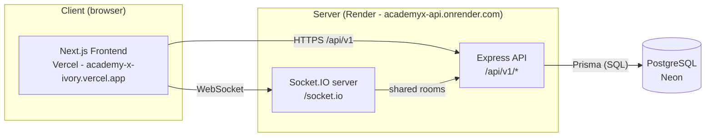
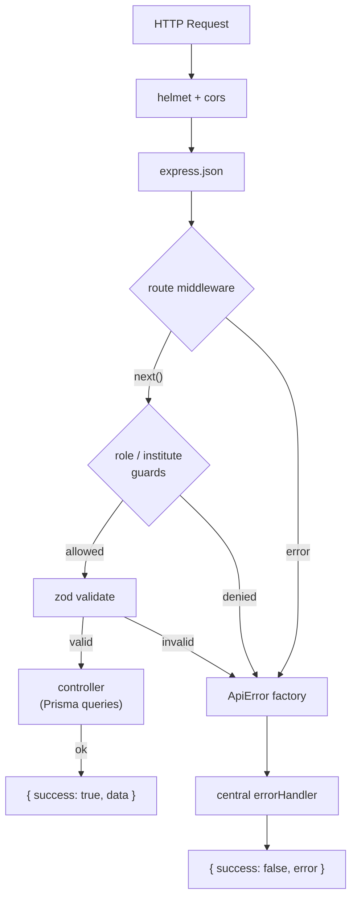
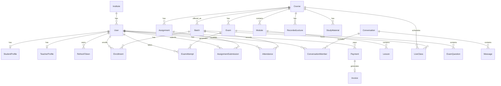
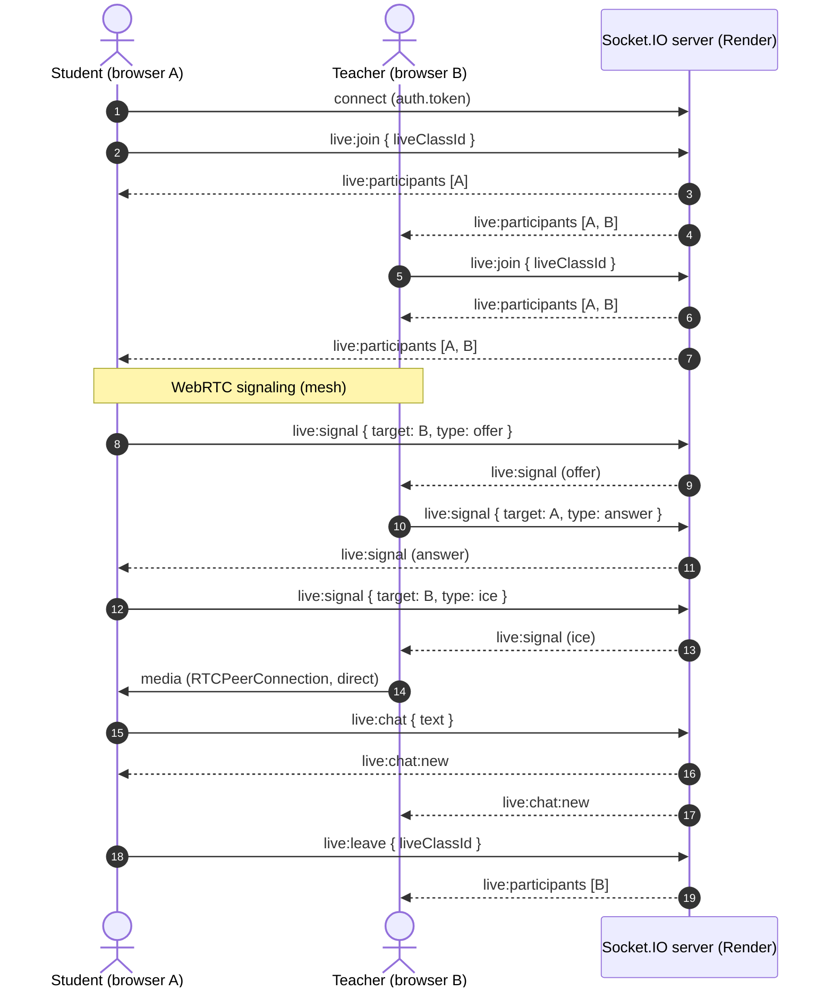
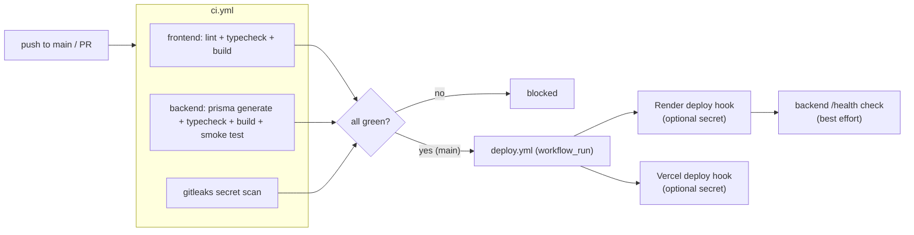

# AcademyX — Architecture

> Living reference. Last updated: 2026-08-04

## 1. High-Level Overview

AcademyX is a **client-server monorepo** with two deployable apps plus a hosted database:



- **API base URL**: `https://academyx-api.onrender.com/api/v1` (health check at `/health`, socket at `/socket.io`).
- **Web app**: `https://academy-x-ivory.vercel.app`.
- Frontend talks to the API through a single client (`frontend/src/lib/api.ts`) and a socket client (`frontend/src/lib/live-socket.ts`).

## 2. Tech Stack

### Backend (`backend/`)
| Concern | Choice |
| --- | --- |
| Runtime | Node.js >= 20 (TypeScript, `tsx` for dev) |
| Framework | Express 4 |
| ORM | Prisma 6 (`@prisma/client`) |
| Database | PostgreSQL (Neon) |
| Validation | zod (schema-driven) |
| Auth | jsonwebtoken (access + rotating refresh) |
| Passwords | bcryptjs |
| Security | helmet, cors (whitelist), rate limiting |
| Real-time | socket.io (presence/chat/signaling) |
| WebRTC | Browser mesh (STUN only), signaling over socket |

### Frontend (`frontend/`)
| Concern | Choice |
| --- | --- |
| Framework | Next.js 15.5 (App Router), React 19 |
| Styling | Tailwind CSS v4 + custom design tokens |
| UI kit | Radix UI primitives + custom shadcn-style components |
| Icons | lucide-react (wrapped by `Icon`) |
| Charts | recharts |
| Real-time | socket.io-client |
| HTTP | Native `fetch` wrapped in `frontend/src/lib/api.ts` |

### Tooling / Delivery
- GitHub Actions CI/CD; Render (API deploy), Vercel (web deploy), Neon (DB); Node 20 pinned via `.nvmrc`.

## 3. Repository Layout

```
New Project/
├── .github/
│   ├── workflows/
│   │   ├── ci.yml        # lint + typecheck + build + backend smoke test + secret scan
│   │   └── deploy.yml    # CI-gated Render/Vercel deploy hooks + health check
│   └── dependabot.yml
├── docs/                 # PRD, Architecture, Rules, Phases, Design, Memory
├── .nvmrc                # node 20
├── backend/
│   ├── prisma/schema.prisma
│   └── src/
│       ├── server.ts             # entrypoint: listen + initLiveSocket
│       ├── app.ts                # express app, middleware, route mounting, /health
│       ├── config/env.ts         # zod-validated env vars
│       ├── lib/prisma.ts         # singleton PrismaClient
│       ├── middleware/           # error, auth (authenticate/requireRole/requireInstitute), validate
│       ├── routes/               # auth, institutes, courses, batches, students, teachers,
│       │                         # exams, assignments, live-classes, lectures, payments,
│       │                         # messages, notifications, dashboard, reports
│       ├── sockets/live-socket.ts# Socket.IO server (presence, chat, signaling)
│       └── utils/                # jwt, ApiError factories, etc.
└── frontend/
    └── src/
        ├── app/                  # Next.js App Router pages (route folders)
        │   ├── page.tsx          # landing page
        │   ├── login|register|forgot-password/
        │   ├── dashboard/        # admin|student|teacher|super-admin
        │   ├── institutes|courses|curriculum|batches|students|teachers/
        │   ├── exams|assignments|lectures|live-classes/
        │   ├── messages|notifications|reports|financials/
        │   ├── onboarding/ settings/ support/
        ├── components/
        │   ├── ui/               # button, card, badge, dialog, sheet, select, table,
        │   │                     # toast, progress, avatar, stat-card, ...
        │   ├── dashboard/        # shells, onboarding banner, stat cards
        │   ├── auth/  layout/  marketing/  shared/  # shared Icon, etc.
        └── lib/
            ├── api.ts            # getStoredUser, api.get/post/patch, token refresh, tryGet
            ├── live.ts           # useLive hook (fetcher + mock fallback)
            ├── live-data.ts      # typed fetchers for every module + mocks
            ├── live-socket.ts    # useLiveSession hook (socket client)
            └── live-webrtc.ts    # useLiveWebRTC hook (mesh video)
```

## 4. Backend Architecture

### 4.1 Request Lifecycle


- Every response is `{ success: true, data }`; every error is `{ success: false, error }`.
- Auth middleware (`authenticate`) verifies the Bearer token via `verifyAccessToken` (`backend/src/utils/jwt.ts`) returning `{ sub, role, instituteId }`.
- `requireInstitute` scopes queries to the caller's `instituteId` (multi-tenancy).
- `requireRole(...roles)` enforces RBAC per route.
- `validate(schema)` runs zod middleware on the body.

### 4.2 Error Handling
- Central `ApiError` factories: `badRequest`, `unauthorized`, `forbidden`, `notFound`, `conflict`, `tooManyRequests`.
- A single `errorHandler` formats them; unexpected errors become 500s.

### 4.3 Data Model (Prisma, 30 models)
Core tenant graph: `Institute → User`; `User → StudentProfile | TeacherProfile`.
Learning graph: `Course → Module → Lesson`; `Course/Batch → Enrollment → Student`; `Batch` linked to course/teacher with schedule + `Attendance`.
Assessment: `Exam → ExamQuestion → ExamAttempt`; `Assignment → AssignmentSubmission`.
Live/Media: `LiveClass`, `RecordedLecture`, `StudyMaterial`, `Announcement`, `Certificate`.
Commerce: `Payment`, `Invoice`.
Comms: `Conversation → ConversationMember → Message`, `Notification`, `SupportTicket`, `ActivityLog`, `AuditLog`, `RefreshToken`.



Notable quirks:
- `ExamAttempt.status` is a **String** (`in_progress | submitted | graded`), not an enum.
- `AssignmentSubmission.status` is an enum `SubmissionStatus` (`SUBMITTED | LATE | GRADED`), `marks Float?`, `feedback String?`.
- `Course.createdById` FK → `TeacherProfile` (RESTRICT) — admins without a profile are auto-created one on `POST /courses`.

### 4.4 Real-Time (Socket.IO)
`backend/src/sockets/live-socket.ts`:
- Server on `/socket.io` path, CORS from `env.CORS_ORIGIN`.
- Handshake auth via `auth.token` (JWT).
- Events: `live:join` / `live:leave` / `live:disconnect` (rooms `live:{id}`, participant registry), `live:chat` (→ `live:chat:new` broadcast), `live:signal` (WebRTC signaling routed by target user id), `live:participants` broadcast on join/leave.
- Wired in `server.ts` via `initLiveSocket(server)`.



## 5. Frontend Architecture

### 5.1 Data Layer
- `frontend/src/lib/api.ts`: `api.get/post/patch` wrap `fetch`, attach `Authorization`, unwrap `{success,data}`, auto-refresh expired access tokens; `getStoredUser()` reads the `ax_session` storage key; `tryGet<T>` returns `null` on any API failure.
- `frontend/src/lib/live.ts`: `useLive(fetcher, mockFallback)` — fetches on mount, keeps a mock fallback while the API is unavailable.
- `frontend/src/lib/live-data.ts`: typed fetchers + mock data per module (exams, assignments, live classes, onboarding, batches, etc.).

### 5.2 Rendering Model
- App Router; pages are client components (`"use client"`) that fetch live data via `useLive`.
- Server components are limited to layout/metadata; interactive data rendering happens client-side.

### 5.3 Real-Time Hooks
- `useLiveSession(liveClassId?)` — socket connect, `live:join`/`live:leave`, returns `{connected, participants, messages, sendChat, sendSignal, onSignal, onChat}`; API origin derived by stripping `/api/v1` from `NEXT_PUBLIC_API_URL`.
- `useLiveWebRTC({enabled, myUserId, participants, sendSignal, onSignal})` — mesh of RTCPeerConnections, deterministic offerer (`me < peer` lexicographic) to avoid glare, Google STUN, camera/mic toggles, cleanup on unmount.

### 5.4 UI Kit
`components/ui` — button, card, badge (variants `default|secondary|success|warning|destructive|outline`), dialog, sheet, select, table, progress, avatar, toast (`useToast`), stat-card. Icons go through `components/shared/icon.tsx` (`Icon name="..."`).

## 6. Configuration & Environment

### Backend (`backend/src/config/env.ts`)
- **Required**: `DATABASE_URL`, `JWT_ACCESS_SECRET`, `JWT_REFRESH_SECRET`.
- **Optional**: `CLOUDINARY_*`, `HMS_*`, `RAZORPAY_KEY_ID`, `RAZORPAY_KEY_SECRET`, `RESEND_API_KEY`, `EMAIL_FROM`.
- **Defaults**: `PORT=5000`, `CORS_ORIGIN=http://localhost:3000`, JWT expiries `15m`/`7d`, `REFRESH_TOKEN_ROTATION=true`, rate limit window/max.

### Frontend
- `NEXT_PUBLIC_API_URL` (falls back to `http://localhost:5000/api/v1`).

## 7. Delivery / CI-CD

- **CI** (`.github/workflows/ci.yml`) on PR + push to `main`: frontend lint/typecheck/build; backend prisma generate/typecheck/build/smoke test (boot + `/health`); gitleaks secret scan.
- **CD** (`.github/workflows/deploy.yml`) gated on CI success on `main`: fires optional Render/Vercel deploy hooks (secrets `RENDER_DEPLOY_HOOK_URL`, `VERCEL_DEPLOY_HOOK_URL`) and does a best-effort backend health wait.
- Render and Vercel also auto-deploy from GitHub integrations; Neon holds the Postgres DB.



> Rendered on GitHub. If you're viewing outside GitHub, open the raw `.md` or a Mermaid-aware viewer (VS Code + Mermaid Preview, Typora, Obsidian).

