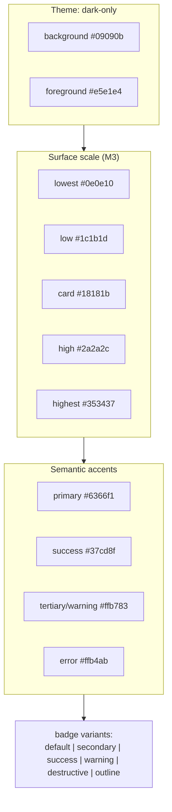
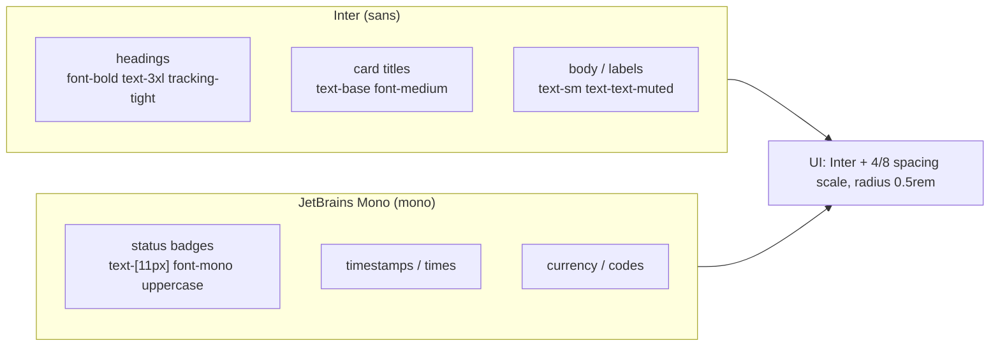

# AcademyX — Design

> Visual design reference, extracted from the implemented codebase (`frontend/src/app/globals.css`, `layout.tsx`).
> Last updated: 2026-08-04

## 1. Design Principles

- **Dark-first, full-stop**: the app is dark-only (the `<html>` element is hardcoded `class="dark"`; `:root` and `.dark` token values are identical).
- **Indigo = action**: primary interactive color is indigo; it drives buttons, links, focus rings, and glows.
- **Material-3 inspired surfaces**: layered neutral surfaces (`surface-container-lowest` → `surface-container-highest`) give depth without color noise.
- **Semantic accents**: green = success, orange = tertiary/warning, red = error — used sparingly.
- **Subtle glow over heavy borders**: interactive elements use soft indigo glows (`indigo-glow`, `active-glow`) and thin `#27272a` borders.

## 2. Color & Theme

### Core tokens
| Token | Hex | Usage |
| --- | --- | --- |
| `--background` | `#09090b` | App background (near-black) |
| `--foreground` | `#e5e1e4` | Default text |
| `--card` | `#18181b` | Cards, popovers, panels |
| `--primary` | `#6366f1` | Buttons, links, active states, ring |
| `--primary-foreground` | `#fafafa` | Text on primary |
| `--ring` | `#6366f1` | Focus ring |
| `--border` / `--border-subtle` | `#27272a` | Borders, dividers |
| `--success` / `--success-green` | `#37cd8f` | Success badges, online dots |
| `--warning` / `--tertiary` | `#ffb783` | Warning/tertiary accents |
| `--error` | `#ffb4ab` | Error text/icons |
| `--destructive` | `#93000a` | Destructive buttons/badges (deep red bg) |

### Material-3 surface scale
`surface` `#18181b` · `surface-dim` `#131315` · `surface-container-lowest` `#0e0e10` · `surface-container-low` `#1c1b1d` · `surface-container` `#201f22` · `surface-container-high` `#2a2a2c` · `surface-container-highest` / `surface-variant` `#353437` · `surface-bright` `#39393b` · `on-surface` `#e5e1e4` · `on-surface-variant` `#c7c4d7` · `inverse-surface` `#e5e1e4` · `outline` `#908fa0` · `outline-variant` `#464554`.

### Semantic text helpers
`text-heading` `#fafafa` · `text-muted` `#a1a1aa`.

### Example color composition
- **Page**: `bg-background` (#09090b), heading text `text-text-heading` (#fafafa), body `text-text-muted` (#a1a1aa).
- **Card**: `bg-surface`/`bg-card` (#18181b), border `border-border-subtle`.
- **Primary button**: `bg-primary text-primary-foreground` (#6366f1 on #fafafa).
- **Badges**: `default` (primary/10 bg), `secondary`, `success` (#37cd8f/10), `warning` (tertiary/10), `destructive` (error/10), `outline`.
- **Glass effect**: `glass-card` = `rgba(24,24,27,0.8)` + `backdrop-filter: blur(8px)`.

## 3. Typography

### Fonts (Google Fonts, loaded via `next/font`)
| Role | Family | Notes |
| --- | --- | --- |
| Sans (default UI) | **Inter** | `--font-inter`; body + headings; `font-family: var(--font-inter)` on `body` |
| Mono (data, badges, time) | **JetBrains Mono** | `--font-jetbrains`; used for `font-mono`, live/status badges, timestamps |

CSS: `--font-sans: var(--font-inter), ui-sans-serif, system-ui, sans-serif;` and `--font-mono: var(--font-jetbrains), ui-monospace, monospace;`.

### Typographic patterns in use
- Page headings: `font-bold text-3xl tracking-tight text-text-heading` (e.g., dashboards, session title).
- Card titles: `text-base`/`font-medium`, often with an inline `Icon` (`h-4 w-4`).
- Labels/meta: `text-sm text-text-muted`.
- Badges: `text-[11px] font-medium font-mono` for status (e.g., `LIVE`, `SUBMITTED`, `GRADED`).
- Body text: `text-sm` default; large landing headings use bold + tracking-tight.
- Antialiasing on body (`antialiased`).

## 4. Shape, Radius & Space

- Base radius: `0.5rem` (`--radius`); derived: `sm = 0.25rem`-ish, `md`, `lg = 0.5rem`, `xl = 0.75rem`-ish.
- Cards: `rounded-lg`/`rounded-2xl` depending on context; chips/badges `rounded-full`.
- Avatars: `rounded-full`; small video tiles `aspect-video` + `rounded-lg`.
- Container padding convention: landing `px-4 md:px-6`; dashboard gap `gap-6`.

## 5. Elevation & Effects

- `indigo-glow`: `box-shadow: 0 0 12px rgba(99,102,241,0.15)` — primary CTAs, active nav.
- `active-glow`: `box-shadow: 0 0 8px rgba(99,102,241,0.15)`.
- `glass-card`: translucent card + `blur(8px)`.
- Thin scrollbars: `custom-scrollbar` / `scroll-thin` (4px, thumb `#27272a`).
- Live indicators: pulsing `bg-error` dot for `LIVE`, `bg-success-green` dot for connected/online.

## 6. Iconography & Imagery

- **lucide-react**, accessed only via the `Icon` component (`frontend/src/components/shared/icon.tsx`, `iconMap`). Add new icons by importing into `iconMap`.
- Material-style names map to lucide (e.g., `arrow_left`, `check_circle`, `play_circle`, `videocam`, `groups`, `menu_book`, `calendar_today`, `currency_rupee`).
- Imagery: UI design assets in `AcademyX_UI_Screens/` are presentation artifacts, not app assets.

## 7. Responsive Behavior

- Landing navigation: desktop nav hidden on mobile; top-right hamburger opens a right-side `Sheet` (`w-72`) with anchor links + Sign in / Get Started.
- Layout grids collapse: 3-column dashboards → 1 column below `lg`; video grids `2/3/4` columns on mobile→desktop.
- Paddings reduce to `px-4` on mobile (`md:px-6`).

## 8. Accessibility Notes

- Contrast: near-black background with `#e5e1e4` foreground; `text-muted #a1a1aa` used for secondary info.
- Focus ring: `ring` token (`#6366f1`); interactive elements have `outline-none` + focus states.
- Status is never conveyed by color alone — badges pair color with `font-mono` uppercase text.
